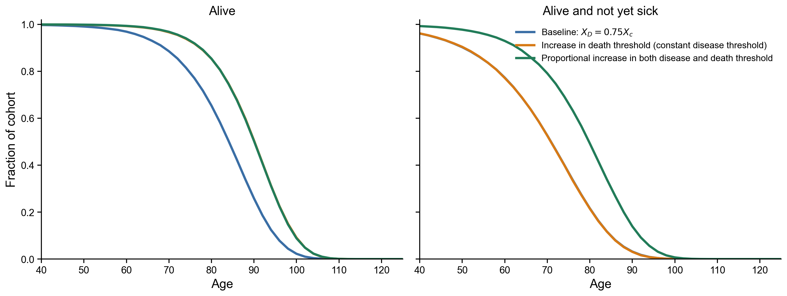
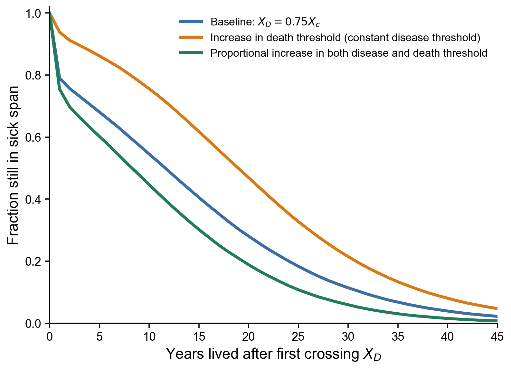
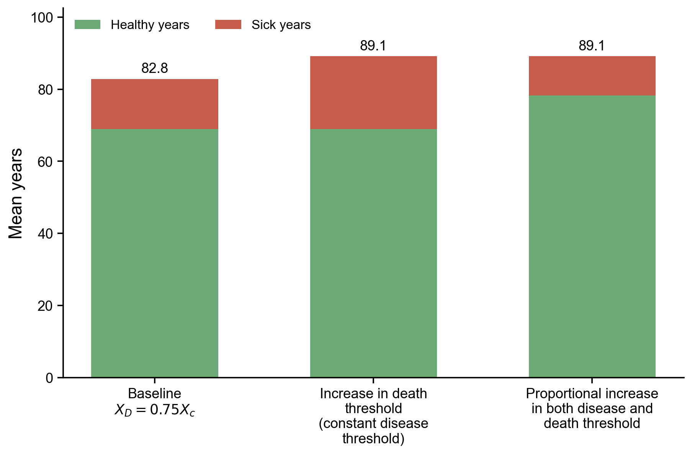
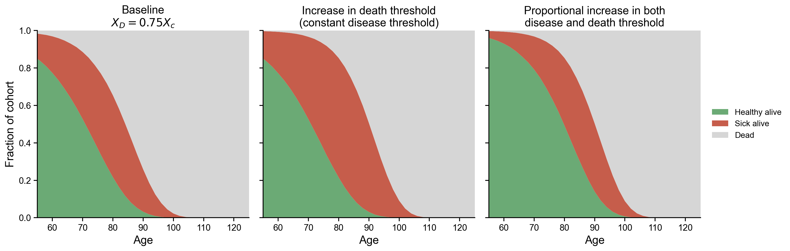
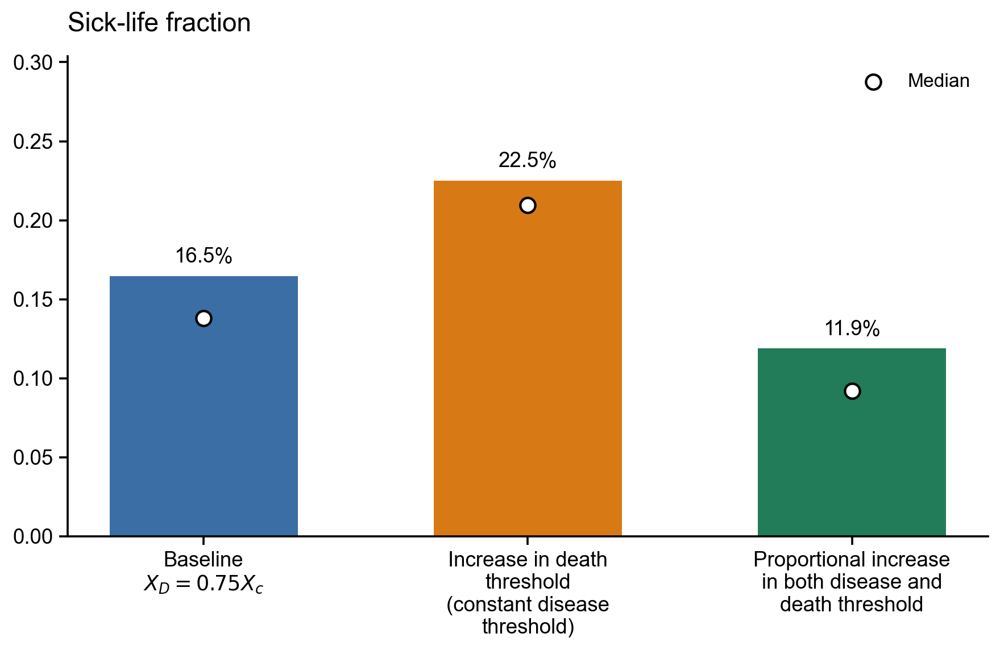
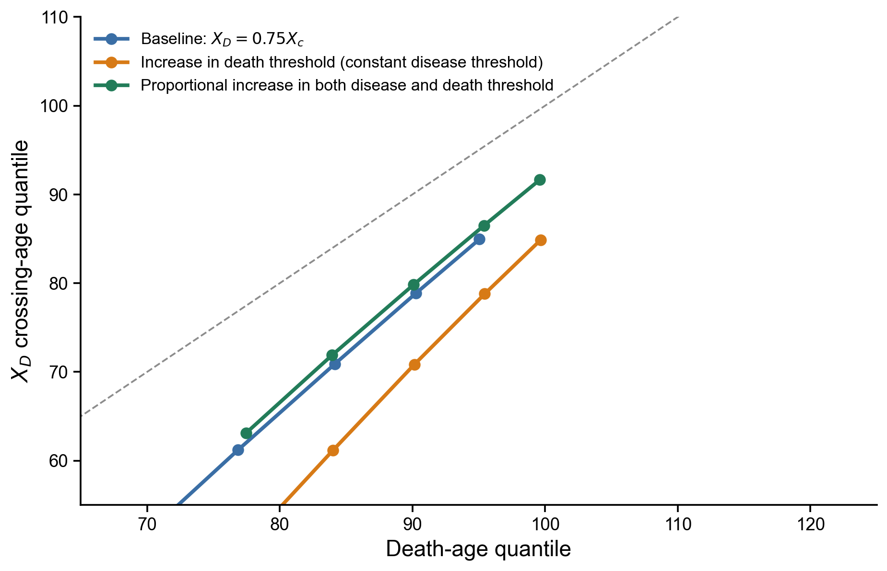
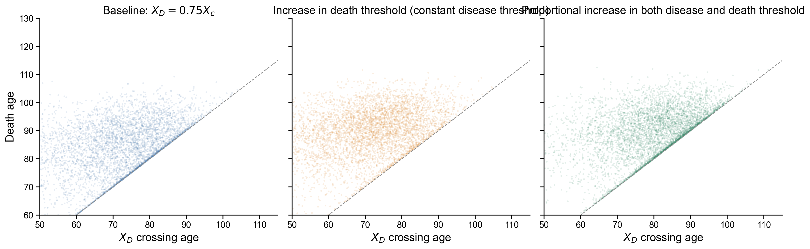

# Artificial Survival Time SR Exploration

This exploration responds to the reviewer concern that some late-life survival gains may not be well described as improved robustness. The operational SR proxy is a disease threshold, \(X_D\), below the critical death threshold, \(X_c\). First crossing of \(X_D\) marks disease onset; first crossing of \(X_c\) remains death.

The three matched simulations use the Sweden 2019 tail-emphasis baseline and the same individual \(X_c\) heterogeneity draws:

- Baseline: \(X_D = 0.75X_c\).
- Increase in death threshold (constant disease threshold): \(X_c\) is multiplied by \(1.2\), while each individual's original \(X_D\) is kept fixed.
- Proportional increase in both disease and death threshold: both \(X_c\) and \(X_D\) are multiplied by \(1.2\).

In this setup, the constant-disease-threshold scenario is a simple model of added survival time after disease onset. The proportional scenario is closer to a robustness-like shift where the disease and death thresholds move together.

## Run Details

- \(n=80,000\) simulated individuals per scenario.
- \(t_{max}=160\), \(\Delta t=0.05\), \(h_{ext}=0\).
- Parallel simulation: `True`.
- Baseline parameters: \(\eta=0.586837\), \(\beta=57.8717\), \(\kappa=0.5\), \(\epsilon=49.7187\), \(X_c=21.7406\), \(\sigma_{X_c}/X_c=0.141421\).

## Summary

| Scenario | Mean lifespan | Mean healthspan | Mean sick span | Mean sick-life fraction |
|---|---:|---:|---:|---:|
| Baseline: $X_D = 0.75X_c$ | 82.80 | 68.93 | 13.87 | 16.5% |
| Increase in death threshold (constant disease threshold) | 89.12 | 68.90 | 20.22 | 22.5% |
| Proportional increase in both disease and death threshold | 89.11 | 78.30 | 10.81 | 11.9% |

## First Read

Relative to baseline, the constant-disease-threshold scenario adds about 6.32 mean years of life but also adds about 6.34 mean sick years.
When \(X_D\) moves with \(X_c\), the model still extends mean lifespan by about 6.32 years, while mean sick span is 3.06 years lower than baseline.

## Plot Gallery

### Supplementary Two-Panel Figure

Focused version for the reviewer response: state composition over age and fraction of lifespan after crossing \(X_D\).

### 01 Lifespan Healthspan Survival

Lifespan survival and healthspan survival separate being alive from being alive without disease.

### 02 Sickspan Survival

Distribution of time spent after crossing \(X_D\), conditional on crossing it.

### 03 Health Sick Stacked Bars

Mean lifespan decomposed into healthy years and sick years.

### 04 Age Specific State Composition

Age-specific cohort composition: healthy alive, sick alive, or dead.

### 05 Sick Fraction Of Life

Mean fraction of life spent after crossing \(X_D\).

### 06 Event Age Quantiles

Matched quantiles of \(X_D\) crossing age versus death age.

### 07 Disease Vs Death Age Scatter

Sampled individual disease-onset and death-age points.

