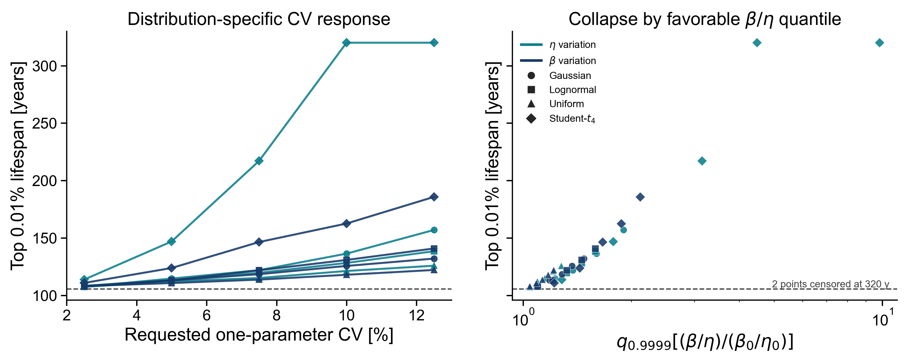
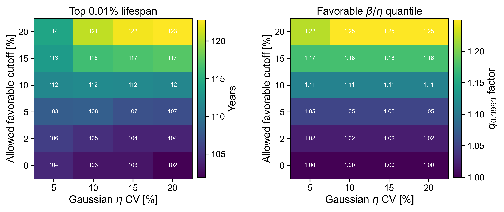
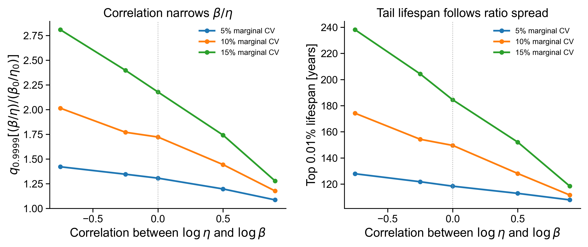
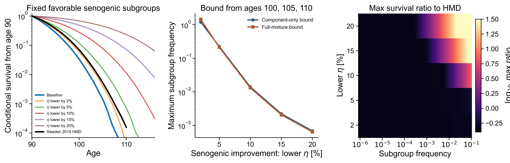

# Senogenic Tail Constraint Exploration

This exploration tests the reviewer-facing criticism that the current heterogeneity result is not distribution-free. The working variable is the senogenic timescale

$$
\tau_{\rm sen}=\frac{\beta}{\eta}.
$$

The goal is not to edit the paper here. The goal is to see whether the simulations support a more precise claim: smooth senogenic heterogeneity is dangerous because it creates a favorable tail in \(\beta/\eta\), while broad central variation can be hidden only if that favorable tail is truncated, depleted, or compensated.

## Assumptions

- Baseline: Sweden 2019 tail-emphasis fit from `saved_results/fit_archive/records/joint2019_tail90_sweden_emphasis.json`.
- Heterogeneity is isolated in senogenic parameters; \(X_c\), \(\epsilon\), and \(h_{\rm ext}\) are fixed unless noted.
- Main scenario simulations use \(n=200,000\), \(t_{max}=320\), \(\Delta t=0.1\), and \(h_{\rm ext}=0\).
- Rare-subgroup component curves use \(n=500,000\).
- The top-tail metric is the age at which unconditional model survival reaches \(10^{-4}\), called top 0.01% lifespan below. Rows that still have more than \(10^{-4}\) survival at \(t_{max}\) are marked as censored lower bounds.
- HMD comparisons use Sweden 2019 period survival conditional on age 90; available local HMD tail points run through age 110.
- This is an exploration, not a final SI figure. Monte Carlo noise is non-negligible at \(10^{-4}\), so the qualitative collapse and boundaries matter more than the last decimal.

## Result 1: distribution shape mostly enters through the favorable \(\beta/\eta\) quantile

Across uncensored Gaussian, lognormal, uniform, and Student-\(t_4\) one-parameter senogenic scenarios, the correlation between \(q_{0.9999}[(\beta/\eta)/(\beta_0/\eta_0)]\) and top 0.01% lifespan was Pearson \(r=0.979\) and Spearman \(\rho=0.946\).
2 heavy-tailed scenario(s) reached \(t_{max}=320\) and are plotted as lower bounds.
The baseline top 0.01% lifespan was 105.8 years.
With 5% Gaussian heterogeneity, \(\eta\) gave 114.7 years and \(\beta\) gave 113.1 years.
With 10% Gaussian \(\eta\) heterogeneity, the top-tail age rose to 136.4 years.

Interpretation: the previous Gaussian/lognormal statement is not distribution-free, but the simulations do support the cleaner statement that the extreme survival tail is governed by the favorable tail of \(\tau_{\rm sen}=\beta/\eta\).

## Result 2: truncating the favorable \(\eta\) tail can rescue broad central variation

Here \(\eta\sim N(\eta_0,\sigma)\) is resampled until it is positive and above a lower cutoff \(\eta_0(1-\delta_{\max})\). Small \(\delta_{\max}\) means the favorable low-\(\eta\) tail is strongly depleted.
For requested 20% Gaussian \(\eta\) CV with only a 2% favorable cutoff, the actual post-truncation \(\eta\) CV was 0.108 and top 0.01% lifespan was 104.0 years.
Allowing the favorable cutoff to extend to 20% at the same requested CV gave actual \(\eta\) CV 0.150 and top 0.01% lifespan 122.8 years.

Interpretation: a distribution with broad apparent central variation can evade the Gaussian-tail criticism, but only by explicitly removing the low-\(\eta\), high-\(\beta/\eta\) individuals. That is the reviewer point, turned into a measurable condition.

## Result 3: correlated \(\eta,\beta\) variation is allowed when it preserves the ratio

For bivariate lognormal variation, the relevant variance is approximately

$$
{\rm Var}[\log(\beta/\eta)]={\rm Var}[\log\beta]+{\rm Var}[\log\eta]-2\rho\sigma_{\log\beta}\sigma_{\log\eta}.
$$

Positive correlation narrows \(\beta/\eta\), so the same marginal CV in \(\eta\) and \(\beta\) produces a much weaker extreme-tail effect.

Interpretation: the constrained object is not arbitrary variation in \(\eta\) or \(\beta\) separately. It is variation in the senogenic direction that changes \(\beta/\eta\).

## Result 4: rare favorable subgroups are tightly bounded by the observed tail

This analysis simulates fixed favorable subgroups with \(\eta=\eta_0(1-\delta)\). Mixtures are then computed analytically as

$$
S_{\rm mix}(t)=(1-p)S_0(t)+pS_\delta(t).
$$

Two bounds are reported. The full-mixture bound asks when \(S_{\rm mix}\) exceeds Sweden 2019 HMD conditional survival at ages 100, 105, or 110. The component-only bound is an interpretable back-of-envelope check: it ignores baseline survivors and asks only that \(pS_\delta(t)\le S_{\rm HMD}(t)\). Values above one mean the chosen ages do not bound the subgroup even at \(p=1\), and are shown as not bounded.

| Lower eta in subgroup | Full-mixture \(p_{\max}\) | Component-only \(p_{\max}\) |
|---:|---:|---:|
| 2% | not bounded | not bounded |
| 5% | 21% | 22.2% |
| 10% | 1.31% | 1.4% |
| 15% | 0.207% | 0.221% |
| 20% | 6.4e-04 | 6.9e-04 |

Interpretation: rare favorable senogenic subgroups are the distribution-free version of the problem. If such a subgroup is common enough, it inflates the observed old-age survival tail regardless of whether the rest of the distribution is Gaussian.

## Bottom line

The analyses support a sharper claim than "senogenic parameters cannot vary." The defensible claim is: human late-life survival constrains the favorable tail of the senogenic timescale \(\beta/\eta\). Smooth, polygenic-like senogenic variation violates this quickly; broader central variation is possible only with tail truncation, tail depletion, or correlated compensation that preserves \(\beta/\eta\).

## Outputs

- Distribution source rows: `saved_results/csv/senogenic_tail_distribution_scenarios.csv`.
- Truncation source rows: `saved_results/csv/senogenic_tail_truncated_eta.csv`.
- Correlation source rows: `saved_results/csv/senogenic_tail_correlated_eta_beta.csv`.
- Mixture bounds: `saved_results/csv/senogenic_tail_mixture_bounds.csv`.
- Mixture grid: `saved_results/csv/senogenic_tail_mixture_grid.csv`.
- Scenario cache: `saved_results/cache/simulations/senogenic_tail_constraints/scenario_results.csv`.
